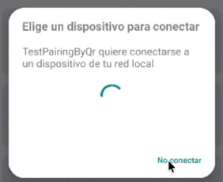

# Fix: selector de dispositivo atascado en `targetSdk 37`

## Síntoma

Al abrir la app aparece el diálogo del sistema **"Elige un dispositivo para conectar"**
("TestPairingByQr quiere conectarse a un dispositivo de tu red local") con un spinner
que gira indefinidamente y solo permite pulsar **"No conectar"**. El descubrimiento
mDNS (pantalla de emparejamiento/conexión adb) nunca resuelve ningún endpoint.



## Causa

El proyecto compila con `compileSdk`/`targetSdk = 37` (Android 17 preview). A partir de
ese nivel, el acceso a la red local queda **bloqueado por defecto**: cualquier llamada a
`NsdManager.discoverServices()` / `resolveService()` —como las de
[`AdbMdnsDiscovery.kt`](app/src/main/java/com/example/testpairingbyqr/adb/AdbMdnsDiscovery.kt)—
cae en el selector nativo de **Local Network Protection**. Como la app no declaraba el
permiso `ACCESS_LOCAL_NETWORK`, el sistema no tiene forma de completar la resolución y el
diálogo se queda esperando para siempre.

| targetSdk | Acceso a red local |
|---|---|
| ≤ 36 | Implícito (basta `INTERNET`) |
| ≥ 37 | Bloqueado salvo que la app tenga `ACCESS_LOCAL_NETWORK` (o use `FLAG_SHOW_PICKER`) |

## Fix

1. **`AndroidManifest.xml`** — se declara el permiso:

   ```xml
   <uses-permission android:name="android.permission.ACCESS_LOCAL_NETWORK" />
   ```

2. **`MainActivity.kt`** — se solicita en runtime (API ≥ 37) antes de arrancar
   `AdbDiscoveryService`, con el mismo patrón que ya se usaba para
   `POST_NOTIFICATIONS`:

   ```kotlin
   if (Build.VERSION.SDK_INT >= 37 &&
       context.checkSelfPermission(Manifest.permission.ACCESS_LOCAL_NETWORK) !=
       PackageManager.PERMISSION_GRANTED
   ) {
       localNetworkPermission.launch(Manifest.permission.ACCESS_LOCAL_NETWORK)
   } else {
       AdbDiscoveryService.start(context)
   }
   ```

   Si el usuario deniega el permiso, se registra un aviso en el log pero la app
   sigue funcionando (sin poder resolver dispositivos por mDNS).

## Por qué esta opción y no `FLAG_SHOW_PICKER`

Android 37 ofrece dos caminos:

- **`ACCESS_LOCAL_NETWORK`**: acceso amplio y continuo a la red local, sin límite de
  cuántos servicios se resuelven a la vez.
- **`DiscoveryRequest.FLAG_SHOW_PICKER`**: no requiere permiso, pero el usuario elige
  *un solo* dispositivo por diálogo del sistema.

Esta app necesita descubrir y mantener actualizados en paralelo **dos** tipos de
servicio (`_adb-tls-pairing._tcp` y `_adb-tls-connect._tcp`) de forma continua desde un
servicio en primer plano, así que el permiso amplio encaja mejor que el picker de un
solo dispositivo.

## Verificación

```bash
./gradlew :app:compileDebugKotlin
./gradlew :app:assembleDebug
```

Ambos compilan sin errores. Falta validar en un dispositivo/emulador con Android 17
(API 37) que, al conceder el permiso, el selector del sistema ya no aparece y los
endpoints de emparejamiento/conexión se resuelven con normalidad.
